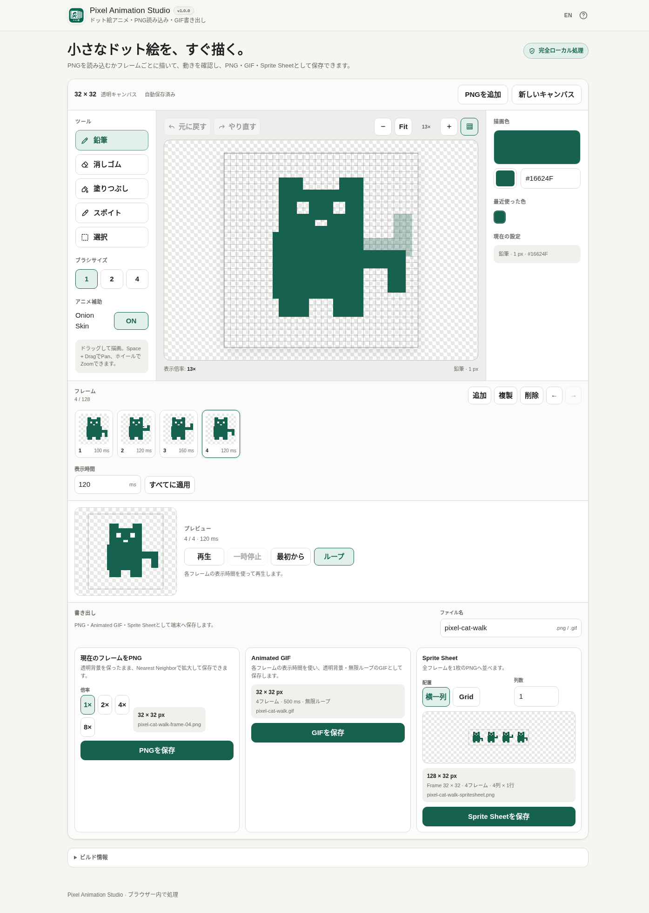

# Pixel Animation Studio

[](https://github.com/ttomohisa/htmlapps-pixel-animation-studio/actions/workflows/deploy-pages.yml)
[](LICENSE)
[](https://ttomohisa.github.io/htmlapps-pixel-animation-studio/)

[English README](README.md)

Pixel Animation Studio は、小さなドット絵アニメーションをフレームごとに描き、動きを確認して、PNG・Animated GIF・Sprite Sheet PNGとして保存できる完全ローカル処理のブラウザーアプリです。読み込んだ画像や描画データをアプリからサーバーへアップロードしません。

## 🚀 デモ

### [GitHub PagesでPixel Animation Studioを開く](https://ttomohisa.github.io/htmlapps-pixel-animation-studio/)

GitHub Pagesから最初のHTMLを読み込んだ後、描画、PNG読み込み、フレーム編集、自動保存、プレビュー、GIF生成、画像保存は端末内で処理されます。読み込んだPNGや描画データがアプリから外部へ送信されることはありません。

[](https://ttomohisa.github.io/htmlapps-pixel-animation-studio/)

## 主な機能

- **小さなキャンバスからすぐ描ける** — 16×16 / 32×32 / 64×64 / 128×128、または最大128×128のCustomサイズを作成できます。
- **ドット絵向けの基本描画** — 鉛筆、消しゴム、塗りつぶし、スポイト、矩形選択、1 / 2 / 4 pxブラシ、Grid、Zoom、Fit、Pan、Pinch Zoomに対応します。
- **実際に塗られる範囲を事前表示** — 鉛筆と消しゴムは、1 / 2 / 4 pxで実際に影響する範囲をCanvas上のカーソル位置に表示します。
- **フレームごとにアニメーションを作成** — 最大128フレームを追加・複製・削除・並べ替えでき、編集中はフレームごとに独立したUndo / Redo履歴を持ちます。
- **表示時間と動きを確認** — 各フレーム20〜5000ms、全フレーム一括設定、Play / Pause / Restart / Loop、前フレームのOnion Skinに対応します。
- **選択範囲を移動・再利用** — 矩形選択したピクセルを移動・コピー・切り取り・貼り付け・削除できます。貼り付けには貼り付け先の選択範囲が必要です。
- **PNGをフレームとして読み込み** — 1枚のPNGから開始するほか、同じサイズの複数PNGをファイル選択やDrag & Dropで追加できます。失敗したファイルは成功分と分けて表示します。
- **用途に合わせて保存** — 現在フレームのPNG、アニメーションGIF、Horizontal / GridのSprite Sheet PNGを書き出せます。
- **端末内へ自動保存** — IndexedDBが利用できる場合、作業内容を自動保存し、再読み込み後に続きから再開できます。
- **PC / スマートフォン対応** — スマホでは「編集 / フレーム / プレビュー / 書き出し」を固定ボトムドックから切り替えます。
- **単一HTML・完全ローカル処理** — アカウント不要、日本語 / 英語、実行時CDNなし、アプリからの実行時外部通信なしで動作します。

## すぐに使う

### Webで使う

[デモを開く](https://ttomohisa.github.io/htmlapps-pixel-animation-studio/)だけで利用できます。インストールやアカウント登録は不要です。

### 単一HTMLを直接使う

1. このリポジトリをダウンロードまたはクローンします。
2. `dist/index.html` を現在のChromium系ブラウザー、Firefox、Safariで開きます。
3. 通常利用では `file://` から直接開けるため、ローカルWebサーバーは不要です。

### ビルドして使う（advanced）

1. Windowsでこのリポジトリをダウンロードまたはクローンします。
2. `build-standalone.bat` をダブルクリックするか、PowerShellから `./build-standalone.ps1` を実行します。
3. 読みやすい単一HTMLとして `dist/index.html` が生成されます。
4. さらに、小さな自己展開版 `dist/index.self-extract.html` も生成されます。

v1.0.0のアプリ本体には実行時の第三者パッケージ依存がないため、エディターやGIFライブラリをビルド時に取得する必要はありません。リポジトリのビルド・検証フローはBrowser Kittyの標準テンプレートに従います。

## 使い方

1. 16×16 / 32×32 / 64×64 / 128×128 / Customからサイズを選ぶか、PNGから開始します。
2. 鉛筆・消しゴム・塗りつぶし・スポイトで描きます。必要に応じてGrid、Zoom、Fit、Pan、最近使った色を利用します。
3. フレームを追加または複製し、ポーズを少しずつ変更します。Onion SkinをONにすると直前のフレームを薄く確認できます。
4. 各フレームの表示時間を設定します。同じ時間に揃える場合は「すべてに適用」を使います。
5. プレビューでPlay / Pause / Restart / Loopを使って動きを確認します。
6. 一部を移動・再利用するときは矩形選択を使います。Copy / Cut後、貼り付け先を選択してからPasteします。
7. 「書き出し」でファイル名を確認し、PNG・Animated GIF・Sprite Sheet PNGとして保存します。
8. 自動保存が利用できる環境では、再度開いたときに「続きから / 新しく作る」を選べます。

### 描画とCanvas操作

- 鉛筆・消しゴムは1 / 2 / 4 px。
- 描画前にCanvas上で実際のブラシ範囲を確認できます。
- PCではマウスホイールでZoomします。
- PCでは `Space + Drag` でPanします。
- タッチ端末では1本指で描画、2本指でPan / Pinch Zoomします。
- Gridは表示補助だけで、保存画像には入りません。

### フレームと表示時間

- 1〜128フレーム。
- 表示時間は20〜5000ms、10ms刻み。
- 複製するとピクセルと表示時間を引き継ぎます。
- フレーム削除はToastの「元に戻す」から取り消せます。
- 編集中はフレームごとに独立した描画Undo / Redo履歴を持ちます。

### 選択とキーボード操作

| ショートカット | 操作 |
| --- | --- |
| `Ctrl` / `⌘` + `Z` | 元に戻す |
| `Ctrl` / `⌘` + `Shift` + `Z` | やり直す |
| `Ctrl` / `⌘` + `C` | 選択範囲をコピー |
| `Ctrl` / `⌘` + `X` | 選択範囲を切り取り |
| `Ctrl` / `⌘` + `V` | 選択中の貼り付け先へ貼り付け |
| `Delete` / `Backspace` | 選択ピクセルを削除 |
| `Esc` | 選択解除 |
| `矢印キー` | 選択ピクセルを1px移動 |
| `Shift` + `矢印キー` | 選択ピクセルを5px移動 |

選択ツールから別のツールへ切り替えると、Canvas上の選択表示は解除されます。内部Clipboardのデータは残る場合がありますが、新しい貼り付け先を選択するまでPasteは無効です。

## 読み込み

- v1.0.0ではPNGのみ対応します。
- 最大128×128のPNG 1枚から、元の寸法でプロジェクトを開始できます。
- 同じサイズの複数PNGをフレームとして追加できます。
- 既存プロジェクトへ追加できるのは、現在のCanvasと同じサイズのPNGだけです。
- サイズ超過、サイズ不一致、非対応形式、デコード失敗は成功分と分けて表示し、同じ操作内の正常なPNGはそのまま追加できます。
- PNGを自動的に縮小・クロップすることはありません。

## 書き出し

### 現在フレームPNG

- 1× / 2× / 4× / 8×。
- 透明背景を維持。
- 拡大はNearest Neighbor。
- 例: `pixel-animation-frame-01.png`。

### Animated GIF

- 現在の全フレームを順番どおり使用。
- フレームごとの表示時間を反映。
- 透明背景・無限ループ。
- GIFは最大256色のため、必要な場合だけGIF出力時に減色します。
- GIFは半透明を持てないため、部分的なAlphaは透明または不透明へ変換します。
- 例: `pixel-animation.gif`。

### Sprite Sheet PNG

- **Horizontal**: 全フレームを横一列へ配置。
- **Grid**: 列数を指定し、行数を自動計算。
- 保存前に全体サイズ、フレームサイズ、行数、列数を表示します。
- 例: `pixel-animation-spritesheet.png`。

## GitHub Pagesで公開する

このリポジトリには、単一HTMLをビルドしてGitHub Pagesへ自動公開するワークフローが含まれています。

1. リポジトリ名を `htmlapps-pixel-animation-studio` としてGitHubへプッシュします。
2. **Settings → Pages → Build and deployment → Source** で **GitHub Actions** を選択します。
3. `main` へプッシュするか、Actionsから **Deploy standalone app to GitHub Pages** を手動実行します。
4. ビルド成功後、`https://ttomohisa.github.io/htmlapps-pixel-animation-studio/` で公開されます。

公開時には単一HTMLを再生成し、リポジトリ検査を通してからPagesへ配置します。

## 開発とビルド

```text
.
├─ src/index.template.html       # アプリ本体のテンプレート
├─ assets/favicon.svg            # アプリアイコン / favicon の元データ
├─ app.config.json               # アプリ情報とビルド設定
├─ dependencies.json             # 実行時依存定義（v1.0.0は空）
├─ dependencies.lock.json        # 依存ロック情報
├─ build-standalone.bat          # Windows用ビルド入口
├─ build-standalone.ps1          # 読みやすい単一HTMLの生成処理
├─ scripts/                      # 検証・自己展開版生成スクリプト
├─ dist/index.html               # 読みやすい単一HTML
└─ dist/index.self-extract.html  # 自己展開単一HTML
```

### ビルド

```powershell
./build-standalone.ps1
```

### リポジトリ検査

```powershell
./scripts/check-repository.ps1
```

リポジトリ検査では、テンプレート契約、単一HTML、CSP / 外部通信方針、依存情報、favicon内包、自己展開版、未解決プレースホルダーなどを確認します。

## プライバシーと通信防止

Pixel Animation Studioは読み込んだ画像と編集データをブラウザー内で処理します。

- PNGのデコードは端末内で行います。
- プロジェクトの自動保存は端末内のIndexedDBを使用します。
- PNG / GIF / Sprite Sheetは端末内で生成します。
- Analytics / Telemetryはありません。
- 外部API、外部フォント、実行時CDN、外部画像、AI APIは使用しません。
- 単一HTMLのContent Security Policyは `connect-src 'none'` を含みます。

GitHub Pages版ではページ本体を取得する最初の通信は発生しますが、読み込んだ画像や描画データをアプリから送信することはありません。完全にネットワークを切って利用する場合は `dist/index.html` をローカルで開いてください。

## 制限事項

- v1.0.0のCanvasは最大128×128です。
- 1プロジェクトは最大128フレームです。
- 読み込みはPNGのみで、GIF / WebP / JPEG / Aseprite / Sprite Sheetの読み込みには対応していません。
- GIFは最大256色で、半透明を保持できません。
- Layers、Lasso、Paletteファイル、Animation Tag、Projectファイル入出力、Animated WebP、Sprite metadata JSONはv1.0.0にはありません。
- 自動保存はIndexedDBに依存します。ブラウザーのサイトデータを削除すると保存済みプロジェクトも消える場合があります。
- Undo / Redo履歴はページ再読み込み後には復元されません。
- 128×128でフレーム数が多いプロジェクトは、特にGIF生成時に端末メモリを多く使用する場合があります。

## 使用ライブラリ

Pixel Animation Studio v1.0.0は、`dependencies.json` に**実行時の第三者依存ライブラリを持ちません**。

Animated GIF Encoderもアプリ内実装です。詳細は [THIRD_PARTY_NOTICES.md](THIRD_PARTY_NOTICES.md) を確認してください。

## コントリビューション

バグ報告や機能提案はIssueからお願いします。開発への参加方法は [CONTRIBUTING.md](CONTRIBUTING.md) を確認してください。

## ライセンス

Copyright © 2026 ttomohisa

このプロジェクトは [MIT License](LICENSE) で公開されています。
