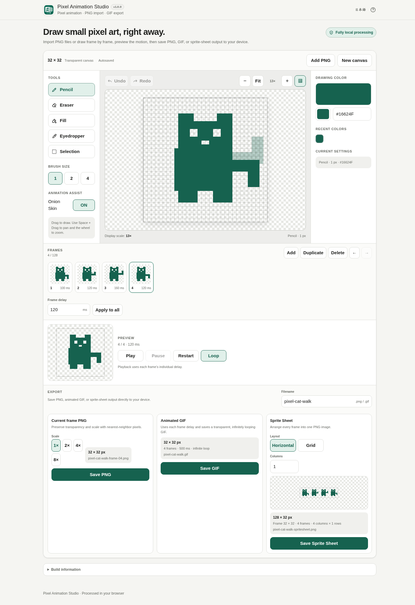

# Pixel Animation Studio

[](https://github.com/ttomohisa/htmlapps-pixel-animation-studio/actions/workflows/deploy-pages.yml)
[](LICENSE)
[](https://ttomohisa.github.io/htmlapps-pixel-animation-studio/)

[日本語版 README](README.ja.md)

Pixel Animation Studio is a small, fully local pixel-art animation editor that runs in the browser. Draw frame by frame, preview motion, and export PNG, animated GIF, or sprite-sheet PNG without uploading your artwork to a server.

## 🚀 Live demo

### [Open Pixel Animation Studio on GitHub Pages](https://ttomohisa.github.io/htmlapps-pixel-animation-studio/)

GitHub Pages delivers the initial HTML. After it loads, drawing, PNG import, frame editing, autosave, preview, GIF encoding, and image export are processed locally on your device. Imported PNG files and pixel data are not uploaded by the app.

[](https://ttomohisa.github.io/htmlapps-pixel-animation-studio/)

## Features

- **Start small and draw immediately** — Create 16×16, 32×32, 64×64, 128×128, or custom canvases up to 128×128 pixels.
- **Pixel-focused drawing tools** — Pencil, Eraser, Fill, Eyedropper, rectangle Selection, 1 / 2 / 4 px brushes, Grid, Zoom, Fit, Pan, and pinch zoom.
- **See the exact brush footprint** — Pencil and Eraser preview the actual 1 / 2 / 4 px area that will be affected before drawing.
- **Build animations frame by frame** — Add, duplicate, delete, reorder, and edit up to 128 frames with independent Undo / Redo history.
- **Tune timing and preview motion** — Set each frame from 20 to 5000 ms, apply one delay to all frames, and use Play / Pause / Restart / Loop plus previous-frame Onion Skin.
- **Move pixel regions with Selection** — Move, copy, cut, paste, delete, and nudge selected pixels. Paste requires an active destination selection.
- **Import PNG frames** — Start from one PNG or add multiple matching-size PNG files through file selection or Drag & Drop, with invalid files reported separately.
- **Export for different uses** — Save the current frame as scaled PNG, the animation as GIF, or every frame as a horizontal/grid sprite sheet.
- **Resume work locally** — Project state is autosaved to IndexedDB and can be restored after reload when browser storage is available.
- **Desktop and smartphone UI** — Mobile uses dedicated Edit / Frames / Preview / Export workspaces with a fixed bottom dock.
- **Private, single-HTML operation** — Japanese/English UI, no account, no runtime CDN, and no runtime network request from the app.

## Quick start

### Use the web demo

Just [open the demo](https://ttomohisa.github.io/htmlapps-pixel-animation-studio/). No installation or account is required.

### Use the standalone HTML

1. Download or clone this repository.
2. Open `dist/index.html` in a current Chromium-based browser, Firefox, or Safari.
3. The file can be opened directly with `file://`; no local server is required for normal use.

### Build it locally (advanced)

1. Download or clone this repository on Windows.
2. Double-click `build-standalone.bat`, or run `./build-standalone.ps1` from PowerShell.
3. Use the generated `dist/index.html` as the readable standalone build.
4. `dist/index.self-extract.html` is also generated as the smaller self-extracting single-HTML variant.

The v1.0.0 application has no runtime third-party package dependency, so the build does not need to fetch an editor or GIF library. The repository build scripts still use the standard Browser Kitty template verification flow.

## Usage

1. Choose 16×16, 32×32, 64×64, 128×128, or Custom, or start from PNG files.
2. Draw with Pencil / Eraser / Fill / Eyedropper. Use Grid, Zoom, Fit, Pan, and Recent Colors as needed.
3. Add or duplicate frames, then edit each pose. Onion Skin can show the previous frame while drawing the next one.
4. Set each frame delay. Use **Apply to all** when the animation should use one common timing value.
5. Open Preview and check the animation with Play / Pause / Restart / Loop.
6. Use rectangle Selection to move or reuse a region. Copy or Cut first, create the destination selection, then Paste.
7. Open Export, edit the filename, and save a PNG, Animated GIF, or Sprite Sheet PNG.
8. When autosave is available, reopening the app offers **Continue / Start new** for the previous local project.

### Drawing and navigation

- Pencil and Eraser support 1 / 2 / 4 px brushes.
- The pointer preview shows the exact brush footprint on the canvas before drawing.
- Mouse wheel changes zoom on desktop.
- `Space + Drag` pans the canvas on desktop.
- One finger draws on touch devices; two fingers pan or pinch zoom.
- Grid can be toggled without affecting exported pixels.

### Frames and timing

- 1 to 128 frames.
- Frame delay: 20–5000 ms in 10 ms steps.
- Duplicate copies the current frame pixels and timing.
- Frame deletion can be undone from the toast action.
- Each frame keeps its own drawing Undo / Redo history during the current session.

### Selection and keyboard shortcuts

| Shortcut | Action |
| --- | --- |
| `Ctrl` / `⌘` + `Z` | Undo |
| `Ctrl` / `⌘` + `Shift` + `Z` | Redo |
| `Ctrl` / `⌘` + `C` | Copy selection |
| `Ctrl` / `⌘` + `X` | Cut selection |
| `Ctrl` / `⌘` + `V` | Paste into the active destination selection |
| `Delete` / `Backspace` | Delete selected pixels |
| `Esc` | Clear the selection |
| `Arrow keys` | Move selected pixels by 1 px |
| `Shift` + `Arrow keys` | Move selected pixels by 5 px |

Switching away from Selection clears the visible selection. Clipboard pixel data may remain inside the app, but Paste is disabled until a new destination selection exists.

## Import

- PNG only in v1.0.0.
- A single PNG can start a project at its native dimensions up to 128×128.
- Multiple PNG files become frames when they share the same dimensions.
- Existing projects only accept PNGs matching the current canvas size.
- Oversized, mismatched, unsupported, or undecodable files are listed separately; valid files from the same batch can still be imported.
- PNG files are never silently resized or cropped.

## Export

### Current Frame PNG

- 1× / 2× / 4× / 8×.
- Transparency preserved.
- Nearest-neighbor scaling.
- Example: `pixel-animation-frame-01.png`.

### Animated GIF

- Uses every frame in the current order.
- Preserves per-frame delay.
- Transparent background and infinite looping.
- GIF is limited to 256 colors; color reduction is applied to GIF output only when needed.
- Partial alpha is converted to transparent or opaque pixels because GIF does not support partial transparency.
- Example: `pixel-animation.gif`.

### Sprite Sheet PNG

- **Horizontal** places all frames in one row.
- **Grid** lets you choose the number of columns and calculates rows automatically.
- The export panel shows sheet size, frame size, rows, and columns before saving.
- Example: `pixel-animation-spritesheet.png`.

## Publish with GitHub Pages

The repository includes a workflow that builds the standalone HTML and deploys it to GitHub Pages automatically.

1. Push the repository to GitHub as `htmlapps-pixel-animation-studio`.
2. Open **Settings → Pages → Build and deployment → Source** and select **GitHub Actions**.
3. Push to `main`, or manually run **Deploy standalone app to GitHub Pages** from the Actions tab.
4. After a successful deployment, the app is available at `https://ttomohisa.github.io/htmlapps-pixel-animation-studio/`.

Each deployment rebuilds the standalone HTML and runs the repository verification checks before publishing.

## Development and build layout

```text
.
├─ src/index.template.html       # Application source template
├─ assets/favicon.svg            # Canonical app / favicon artwork
├─ app.config.json               # App identity and build settings
├─ dependencies.json             # Runtime dependency declaration (empty in v1.0.0)
├─ dependencies.lock.json        # Locked dependency metadata
├─ build-standalone.bat          # Windows build entry point
├─ build-standalone.ps1          # Readable standalone HTML builder
├─ scripts/                      # Verification and self-extract build scripts
├─ dist/index.html               # Readable standalone artifact
└─ dist/index.self-extract.html  # Self-extracting standalone artifact
```

### Build

```powershell
./build-standalone.ps1
```

### Repository check

```powershell
./scripts/check-repository.ps1
```

The repository check validates the template contract, standalone output, CSP/network policy, dependency metadata, favicon embedding, self-extracting output, and unresolved build placeholders.

## Privacy and runtime network protection

Pixel Animation Studio processes imported images and editing data in the browser.

- Imported PNG pixels are decoded locally.
- Project autosave uses IndexedDB on the current device.
- PNG, GIF, and sprite-sheet files are generated locally.
- No analytics or telemetry is included.
- No external API, remote font, runtime CDN, image host, or AI service is used.
- The standalone HTML includes a Content Security Policy with `connect-src 'none'`.

The GitHub Pages version naturally makes an initial request to download the page itself. After the application has loaded, user artwork is not transmitted by the app. To work with the network completely disconnected, open `dist/index.html` locally.

## Limitations

- Canvas dimensions are limited to 128×128 pixels in v1.0.0.
- A project can contain up to 128 frames.
- Input is PNG only; GIF, WebP, JPEG, Aseprite, and sprite-sheet import are not supported in v1.0.0.
- GIF output is limited to 256 colors and cannot preserve partial alpha.
- Layers, lasso selection, palette files, animation tags, project-file import/export, Animated WebP, and sprite metadata JSON are not included in v1.0.0.
- Autosave depends on IndexedDB. Clearing browser site data can remove the locally saved project.
- Undo / Redo history is not restored after a page reload.
- Large 128×128 projects with many frames can use more memory, especially during GIF encoding.

## Dependencies

Pixel Animation Studio v1.0.0 has **no runtime third-party dependencies** declared in `dependencies.json`.

Animated GIF encoding is implemented directly in the application. See [THIRD_PARTY_NOTICES.md](THIRD_PARTY_NOTICES.md) for details.

## Contributing

Bug reports and feature proposals are welcome through GitHub Issues. See [CONTRIBUTING.md](CONTRIBUTING.md) for development guidance.

## License

Copyright © 2026 ttomohisa

Licensed under the [MIT License](LICENSE).
